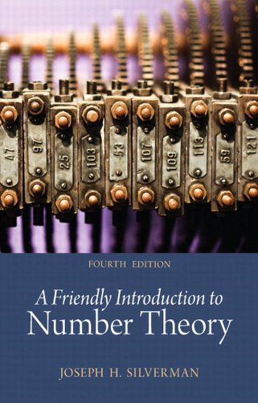

# A Friendly Introduction to Number Theory

## Description:
A Friendly Introduction to Number Theory, Fourth Edition is designed to introduce readers to the overall themes and methodology of mathematics through the detailed study of one particular facet—number theory. Starting with nothing more than basic high school algebra, readers are gradually led to the point of actively performing mathematical research while getting a glimpse of current mathematical frontiers. The writing is appropriate for the undergraduate audience and includes many numerical examples, which are analyzed for patterns and used to make conjectures. Emphasis is on the methods used for proving theorems rather than on specific results.

## Solutions to Exercises:
| Chapter | Documents | Exercise Code |
| ------- | --------- | ------------- |
| 1. What is Number Theory? | <kbd>[TeX](https://github.com/hunterjmatthews/A-Friendly-Introduction-to-Number-Theory/blob/main/Chapters/Chapter%201/chapter1.tex)</kbd> <kbd>[PDF](https://github.com/hunterjmatthews/A-Friendly-Introduction-to-Number-Theory/blob/main/Chapters/Chapter%201/Chapter1.pdf)</kbd> | <kbd>[Python]()</kdb> |
| 2. Pythagorean Triples | [TeX][PDF] | <kbd>[Python]()</kdb> |
| 3. Pythagorean Triples and the Unit Circle | [TeX][PDF] | <kbd>[Python]()</kdb> |
| 4. Sums of Higher Powers and Fermat's Last Theorem | [TeX][PDF] | <kbd>[Python]()</kdb> |
| 5. Divisibility and the Greatest Common Divisor | [TeX][PDF] | <kbd>[Python]()</kdb> |
| 6. Linear Equations and the Greatest Common Divisor | [TeX][PDF] | <kbd>[Python]()</kdb> |
| 7. Factorization and the Fundamental Theorem of Arithmetic | [TeX][PDF] | <kbd>[Python]()</kdb> |
| 8. Congruences | [TeX][PDF] | <kbd>[Python]()</kdb> |
| 9. Congruences, Powers, and Fermat's Little Theorem | [TeX][PDF] | <kbd>[Python]()</kdb> |
| 10. Congruences, Powers, and Euler's Formula | [TeX][PDF] | <kbd>[Python]()</kdb> |
| 11. Euler's Phi Function and the Chinese Remainder Theorem  | [TeX][PDF] | <kbd>[Python]()</kdb> |
| 12. Prime Numbers | [TeX][PDF] | <kbd>[Python]()</kdb> |
| 13. Counting Primes | [TeX][PDF] | <kbd>[Python]()</kdb> |
| 14. Mersenne Primes  | [TeX][PDF] | <kbd>[Python]()</kdb> |
| 15. Mersenne Primes and Perfect Numbers  | [TeX][PDF] | <kbd>[Python]()</kdb> |
| 16. Powers Modulo m and Successive Squaring | [TeX][PDF] | <kbd>[Python]()</kdb> |
| 17. Computing kth Roots and Modulo m | [TeX][PDF] | <kbd>[Python]()</kdb> |
| 18. Powers, Roots, and "Unbreakable" Codes | [TeX][PDF] | <kbd>[Python]()</kdb> |
| 19. Primality Testing and Carmichael Numbers | [TeX][PDF] | <kbd>[Python]()</kdb> |
| 20. Squares Modulo p  | [TeX][PDF] | <kbd>[Python]()</kdb> |
| 21. Quadratic Reciprocity  | [TeX][PDF] | <kbd>[Python]()</kdb> |
| 22. Proof of Quadratic Reciprocity  | [TeX][PDF] | <kbd>[Python]()</kdb> |
| 23. Which Primes Are Sums of Two Squares?  | [TeX][PDF] | <kbd>[Python]()</kdb> |
| 24. Which Numbers are Sums of Two Squares?  | [TeX][PDF] | <kbd>[Python]()</kdb> |
| 25. Euler's Phi Function and Sums of Divisors | [TeX][PDF] | <kbd>[Python]()</kdb> |
| 26. Powers Modulo p and Primitive Roots | [TeX][PDF] | <kbd>[Python]()</kdb> |
| 27. Primitive Roots and Indices | [TeX][PDF] | <kbd>[Python]()</kdb> |
| 28. The Equation X+Y=Z | [TeX][PDF] | <kbd>[Python]()</kdb> |
| 29. Square-Triangular Numbers Revisited | [TeX][PDF] | <kbd>[Python]()</kdb> |
| 30. Pell's Equation | [TeX][PDF] | <kbd>[Python]()</kdb> |
| 31. Diophantine Approximation | [TeX][PDF] | <kbd>[Python]()</kdb> |
| 32. Diophantine Approximation and Pell's Equation | [TeX][PDF] | <kbd>[Python]()</kdb> |
| 33. Number Theory and Imaginary Numbers | [TeX][PDF] | <kbd>[Python]()</kdb> |
| 34. The Gaussian Integers and Unique Factorization | [TeX][PDF] | <kbd>[Python]()</kdb> |
| 35. Irrational Numbers and Transcendental Numbers | [TeX][PDF] | <kbd>[Python]()</kdb> |
| 36. Binomial Coefficients and Pascal's Triangle | [TeX][PDF] | <kbd>[Python]()</kdb> |
| 37. Fibonacci's Rabbits and Linear Recurrence Sequences | [TeX][PDF] | <kbd>[Python]()</kdb> |
| 38. Cubic Curves and Elliptic Curves | [TeX][PDF] | <kbd>[Python]()</kdb> |
| 39. Elliptic Curves with Few Rational Points | [TeX][PDF] | <kbd>[Python]()</kdb> |
| 40. Points on Elliptic Curves Modulo p | [TeX][PDF] | <kbd>[Python]()</kdb> |
| 41. Torsion Collections Modulo p and Bad Primes | [TeX][PDF] | <kbd>[Python]()</kdb> |
| 42. Defect Bounds and Modularity Patterns | [TeX][PDF] | <kbd>[Python]()</kdb> |
| 43. Elliptic Curves and Fermat's Last Theorem | [TeX][PDF] | <kbd>[Python]()</kdb> |
| 44. The Topsy-Turvy World of Continued Fractions | [TeX][PDF] | <kbd>[Python]()</kdb> |
| 45. Continued Fractions and Pell's Equation | [TeX][PDF] | <kbd>[Python]()</kdb> |
| 46. Generating Functions | [TeX][PDF] | <kbd>[Python]()</kdb> |
| 47. Sums of Powers | [TeX][PDF] | <kbd>[Python]()</kdb> |
